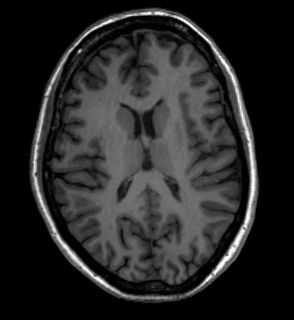
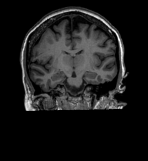
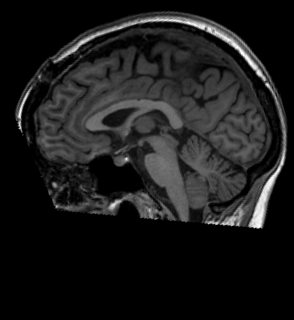
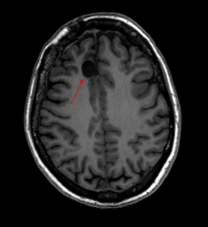
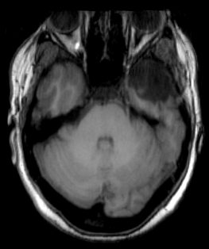
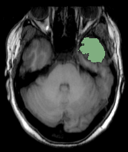

# BrainMRISeg
Projeto final para a disciplina de Processamento de Imagens ICMC-USP

## Título
**Segmentação assistida de regiões de interesse em imagens de ressonância magnética cerebral**

### Integrantes
>**Iury Andrade** 

>**Rodrigo Duarte**

### Resumo
Este projeto almeja trabalhar com segmentação de regiões de interesse em imagens médicas a fim de realizar a segmentação de regiões de maneira assistida, a partir de pontos iniciais de interesse de um especialista de domínio. É desejado entender as situações e diferentes métodos de segmentação que podem ser aplicados, realizando-se um comparativo entre diferentes abordagens, e também comparativamente com resultados de segmentações realizadas de maneira manual por especialistas.

As imagens são provenientes de ressonância magnética (IRM) da região cerebral, de topologia definida por uma malha/grid tridimensional, onde serão extraídas partições (slices) específicos da aquisição, obtendo-se finalmente uma imagem bidimensional para ser processada. Imagens médicas, podem acabar sendo de difícil execução em relação a segmentação, possuindo padrões complexos e diversos casos limítrofes que podem ocasionar errôneas descontinuidades. Ao mesmo tempo, realizar a segmentação manual dessas estruturas é custoso por exigir profissionais especializados, trabalhoso, demorado e entendiante, sendo assim bastante beneficiado por métodos que auxiliem na segmentação assistida a partir de localizações iniciais. 

### Descrição do conjunto de Dados
O conjunto de dados adotado neste projeto é o [EPISURG](https://rdr.ucl.ac.uk/articles/dataset/EPISURG_a_dataset_of_postoperative_magnetic_resonance_images_MRI_for_quantitative_analysis_of_resection_neurosurgery_for_refractory_epilepsy/9996158/1) de imagens de ressonância magnética cerebrais. Este conjunto é composto por 430 aquisições posteriores a intervenção cirúrgicas de pacientes com epilepsia, dos quais 268 também possuem imagens pré-operatórias. Ainda, um subgrupo de pacientes possuem também máscaras de segmentação das regiões extraídas durante a intervenção cirúrgica, sendo as máscaras especificadas por até três diferentes especialistas. Este último subgrupo com máscaras de segmentação são o conjunto de imagens adotadas durante este projeto.

O conjunto de dados esta organizado de maneira semelhante ao padrão BIDS, comumente adotado para este tipo de dados, possuindo um arquivo `subjects.csv` com a listagem dos pacientes e informações sobre a localização do procedimento, sexo e presença ou ausência de imagens pré-operatórias. Cada paciente do conjunto possui ao menos uma MRI do tipo T1. 

As aquisições MRI representam a informação volumétrica distribuída em uma malha/grid tridimensional. Sendo assim, diferentemente de imagens convencionais que são representadas por pixeis que medem intensidade de luz, as MRI são representadas por voxeis que representam valores de intensidade volumétrica. Contudo, para fins de visualização, podemos observar estas imagens como imagens convencionais em tons de cinza.

#### Exemplos de imagens do conjunto de dados
As imagens de MRI podem ser adquiridas por meio de diferentes modalidades, sendo as presentes no conjunto de dados imagens MRI do tipo T1. Nestas, as regiões mais claras na imagem representam as áreas de massa branca cerebral, enquanto as regiões mais cinzas as regiões de massa cinzenta. Ainda, demais líquidos como os fluidos cérebro-espinais e regiões “vazias” aparecem em tons mais escuros, aproximando-se do preto. Ossos aparecem como densas regiões claras. As imagens T1 são consideradas as mais anatômicas devido a característica de poderem ser observadas as regiões mais características e utilizadas como referencial do cérebro. 

Além de sua visualização como uma estrutura tridimensional, as MRIs podem ser observadas por meio de recortes específicos de fatias bidimensionais em locais de interesse. Essas fatias podem ser observadas de acordo com a perspetiva desejada: axial (visão como visto paralelo aos pés), coronal (visão como visto paralelo ao rosto) e sagital (visão como visto paralela ao comprimento do corpo). Estas perspectivas são apresentadas na Figura 1(a), (b) e (c), respectivamente 

 

Figura 1: Topo esquerdo: Imagem na perspectiva axial; Topo direito: Imagem na perspectiva coronal; Inferior esquerdo: Imagem na perspetiva sagital. Fonte: [EPISURG dataset](https://rdr.ucl.ac.uk/articles/dataset/EPISURG_a_dataset_of_postoperative_magnetic_resonance_images_MRI_for_quantitative_analysis_of_resection_neurosurgery_for_refractory_epilepsy/9996158/1)

------
Durante este trabalho, as MRI são exploradas e utilizadas em sua representação em fatias bidimensionais, em suas perspectivas axial, coronal e sagital (de acordo com a intenção do durante o momento da execução) e representadas em tons de cinza.
Para os métodos de segmentação, estamos interessados nas regiões como apresentado no detalhe da Figura 2. A seta aponta uma região extraída por procedimento cirúrgico, em tom escuro devido à ausência do tecido.

 

Figure 2: Detalhe de região extraída durante procedimento cirurgico. Devido a ausência de massa cerebral, região se apresenta como uma tonalidade escura na imagem T1. Fonte: [EPISURG dataset](https://rdr.ucl.ac.uk/articles/dataset/EPISURG_a_dataset_of_postoperative_magnetic_resonance_images_MRI_for_quantitative_analysis_of_resection_neurosurgery_for_refractory_epilepsy/9996158/1)

------
O objetivo assim é obter máscaras de segmentação como apresentada nas imagens da Figura 3(b). 

 

Figura 3(a) Imagem exemplo de IRM cerebral de região extraída por meio de intervenção cirúrgica, sem máscara de segmentação; (b) Imagem exemplo de IRM cerebral de região com região extraída e com máscara de segmentação. Fonte: [EPISURG dataset](https://rdr.ucl.ac.uk/articles/dataset/EPISURG_a_dataset_of_postoperative_magnetic_resonance_images_MRI_for_quantitative_analysis_of_resection_neurosurgery_for_refractory_epilepsy/9996158/1)
